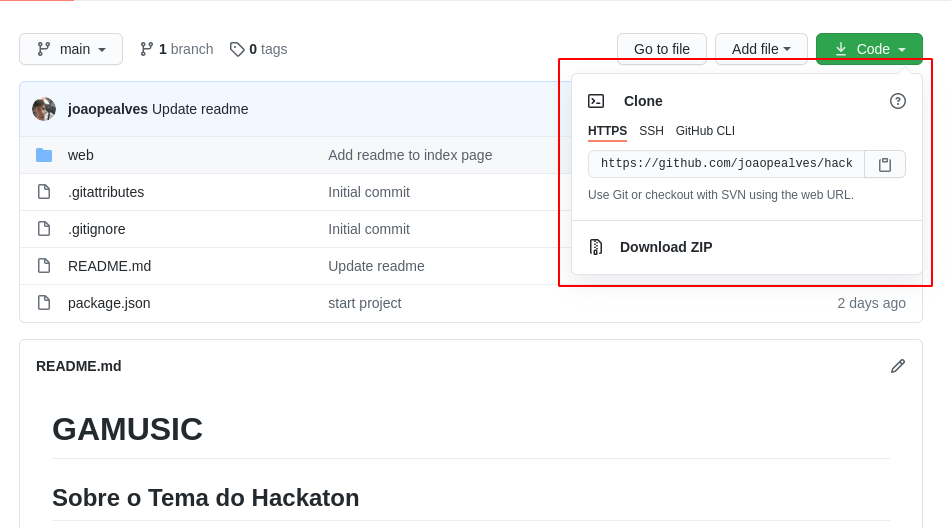

# GAMUSIC

## Sobre o Tema do Hackaton

Desafio final proposto pela Hackathon Code/Stage | Sony Music, o tema era: Como a Inteligência Artificial e o Machine Learning podem melhorar a experiência de consumo e impulsionar o mercado da música?

## Sobre o nosso projeto

Nossa extensão web com gamificação e IA, integrada às principais plataformas de streaming, mapeia o comportamento dos usuários e é capaz classificar usuários de acordo com arquétipos de personalidade.

Queremos ajudar o Filtr Game a automatizar recomendações de artistas nacionais de acordo com seus gêneros de interesse e personalidade.

Quanto mais artistas diferentes o usuário ouvir, mais pontos pode ganhar para trocar por benefícios diversos.

Além disso, os insights gerados pelo Gamusic podem ajudar a Sony a realizar projetos de marketing, desenvolvimento artístico e parcerias comerciais de forma mais assertiva.

<h1> Como instalar o Front end</h1>
<h2>Download do Projeto</h2>
    
      
    
Faça o clone do Repositorio em sua maquina com o comando <code>git clone https://github.com/joaopealves/hackatonProject.git</code>

  
<h2><strong>Adicione-me ao seu git</strong></h2>

É necessário instalar a node_modules

Use <code>npm init -y</code> caso esteja usando o npm, se optar por utilizar o yarn utilize o comando <code>yarn</code>

após a instalação do node_modules basta digitar pelo terminal

    cd hackatonProject/web -> yarn start

mas caso não apareça ou esteja usando uma versão antiga, adicione ao packaje.json

dentro de:

<pre>scripts: {
    "start":"react-scripts start"
}</pre>

# Desenvolvedores

### [João Pedro Alves](https://github.com/joaopealves)

### [Willian Caetano](https://github.com/williancae)

### [César Avelar](https://github.com/cesarxexeu)

# LinkedIn dos participantes do projeto

<h3><a href="https://www.linkedin.com/in/joão-pedro-alves-910858163/">Joao Pedro </a><h3>

<h3><a href="https://www.linkedin.com/in/willian-caetano-670546185/">Willian Caetano </a><h3>

### [César Avelar](https://www.linkedin.com/in/willian-caetano-670546185/)

### [Karina Balan](https://www.linkedin.com/in/karina-balan-julio-207b6299/)

# Tecnologias usadas

<ul>
    <li>HTML 5</li>
    <li>CSS 3 </li>
    <li>TypeScript</li>
    <li>JavaScript</li>
    <li>React.js</li>
    <li>Node.js</li>
</ul>
